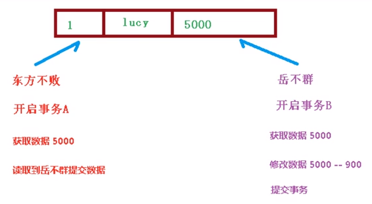
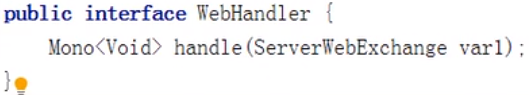

# Spring5 - 尚硅谷

**开始于：2021‎年‎11‎月‎13‎日**

# 一、Spring 框架概述

##  入门案例

1. 下载 Spring5。
   1. 使用 Spring 最新稳定版本 5.2.6
   2. 下载地址 https://repo.spring.io/release/org/springframework/spring/

2. 打开 idea 工具，创建普通 Java 工程。
3. 导入 Spring5 相关 jar 包。
4. 创建普通类，在这个类创建普通方法。
5. 创建 Spring 配置文件，在配置文件配置创建的对象。Spring 配置文件使用 xml 格式。
6. 进行测试代码编写。


***

# 二、IOC容器

## (一) IOC概念和原理

<h4>1. 什么是IOC（控制反转）</h4>

（1）把对象创建和对象之间的调用过程，交给Spring进行管理。

（2）使用IOC目的：为了降低耦合度。（重复代码）

<h4>2. IOC底层</h4>

​		xml解析、工厂模式、反射。


<h4>3. Spring提供的IOC容器实现的两种方式（两个接口）</h4>

1. BeanFactory接口：

   IOC容器基本实现是Spring内部接口的使用接口，不提供给开发人员进行使用（加载配置文件时候不会创建对象，在获取对象时才会创建对象）。

2. ApplicationContext接口：

   BeanFactory接口的子接口，提供更多更强大的功能，提供给开发人员使用（加载配置文件时候就会把在配置文件对象进行创建）(推荐使用)。

IOC 思想基于 IOC 容器完成，IOC 容器底层就是对象工厂。ApplicationContext接口的实现类（具体根据API文档查看☺）。


***

## (二) IOC操作Bean管理

>1. 什么是 Bean 管理？
>
>   Bean 管理指的是两个操作：（1）Spring 创建对象。（2）Spirng 注入属性。
>
>2. Bean 管理操作有两种方式：
>
>（1）基于 xml 配置文件方式实现。（2）基于注解方式实现。

### A. 基于 XML 方式

#### 1. 创建对象

（1）在 spring 配置文件中，使用 bean 标签，标签里面添加对应属性，就可以实现对象创建。

```xml
<!--配置User对象创建-->
<bean id="user" class="demo.User"></bean>
```

（2）在 bean 标签有很多属性，介绍常用的属性：

* id 属性：唯一标识。

* class 属性：类全路径（从src开始到包和类的路径）。


（3）创建对象时候，默认也是执行 **无参构造方法** 完成对象创建。

***

#### 2. 注入属性的方法


DI：依赖注入，就是注入属性。

<h5>2.1 使用 set 方法进行注入</h5>

（1）创建类，定义属性和对应的 set 方法。

（2）在 spring 配置文件配置对象创建，配置属性注入。

```xml
<!--配置Book对象创建，set方法注入属性-->
<bean id="book" class="demo.Book">
    <!--使用 property 完成属性注入
        name：类里面属性名称
        value：向属性注入的值
    -->
    <property name="name" value="Java入门"></property>
    <property name="author" value="Irene"></property>
</bean>
```

（3）测试代码。

```java
@Test
public void testSpring() {
    //1 加载 spring 配置文件
    ApplicationContext context = new ClassPathXmlApplicationContext("bean1.xml");
    //2 获取配置创建的对象
    Book book = context.getBean("book", Book.class);
    System.out.println(book);
    book.testSpring();
}
```


<h5>2.2 使用有参数构造进行注入</h5>

（1）创建类，定义属性，创建属性对应有参数构造方法。

（2）在 spring 配置文件中进行配置。

```xml
<!--配置Order对象创建，带参构造方法注入属性-->
<bean id="order" class="demo.Order">
    <constructor-arg name="name" value="电脑"></constructor-arg>
    <constructor-arg name="address" value="China"></constructor-arg>
</bean>
```


<h5>2.3 p名称空间注入（了解）</h5>

使用 p 名称空间注入，可以简化基于 xml 配置方式。

（1）添加 p 名称空间在配置文件中。

```xml
xmlns:p="http://www.springframework.org/schema/p"
```

（2）进行属性注入，在 bean 标签里面进行操作。

```xml
<bean id="book" class="demo.Book" p:address="China"></bean>
```


***

#### 3. 注入其他类型属性

<h5>3.1 字面量</h5>

（1）null值。

```xml
<!--注入为null值-->
<property name="address">
	<null/>
</property>
```

（2）属性值包括特殊符号。

```xml
<!--属性值包含特殊符号
    1 把<>进行转义 &lt; &gt;
    2 把带特殊符号内容写到 CDATA
-->
<property name="address">
	<value><![CDATA[<<南京>>]]></value>
</property>
```


<h5>3.2 外部bean</h5>

（1）创建两个类 service 类和 dao 类。

（2）在 service 调用 dao 里面的方法。

```java
public class UserDaoImpl implements UserDao {
    @Override
    public void update() {
        System.out.println("Dao update()....");
    }
}

public class UserServiceImpl implements UserService {
    private UserDao userDao; //对象属性
    public UserServiceImpl() { //默认走无参构造和setXxx方法
    }
    public UserServiceImpl(UserDao userDao) { //带参构造
        this.userDao = userDao;
    }
    public void setUserDao(UserDao userDao) { //setXxx方法
        this.userDao = userDao;
    }
    @Override
    public void add() {
        System.out.println("Service add()....");
        userDao.update();
    }
}
```

（3）在 spring 配置文件中进行配置。

```xml
<!--配置Dao和Service-->
<bean id="userService" class="service.UserServiceImpl">
    <!--set方法注入userDao对象
        name 属性：类里面属性名称
        ref 属性：创建 userDao 对象 bean 标签 id 值
    -->
	<property name="userDao" ref="dao"></property>
	<!--带参构造方法注入对象属性-->
	<constructor-arg name="userDao" ref="dao"></constructor-arg>
</bean>
<bean id="dao" class="dao.UserDaoImpl"></bean>
```


<h5>3.3 内部bean</h5>

（1）一对多关系：部门和员工。

* 一个部门有多个员工，一个员工属于一个部门。
* 部门是一，员工是多。

（2）在实体类之间表示一对多关系，员工表示所属部门，使用对象类型属性进行表示。

```java
//部门类
public class Dept {
    private String name;
    public void setName(String name) {
        this.name = name;
    }
}

//员工类
public class Emp {
    private String name;
    private String gender;
    //员工属于某一个部门，使用对象形式表示
    private Dept dept;
    public void setDept(Dept dept) {
        this.dept = dept;
    }
    public void setName(String name) {
        this.name = name;
    }
    public void setGender(String gender) {
        this.gender = gender;
    }
}
```

（3）在 spring 配置文件中进行配置。

```xml
<!--内部bean方式注入 - Dept和Emp-->
<bean id="emp" class="cn.bean.Emp">
    <property name="name" value="猫猫"></property>
    <property name="gender" value="女"></property>
    <property name="dept">
        <bean id="dept" class="cn.bean.Dept">
            <property name="name" value="IT部门"></property>
        </bean>
    </property>
</bean>
```


<h5>3.4 级联赋值</h5>

（1）方式一：外部bean赋值。

```xml
<bean id="emp" class="cn.bean.Emp">
    <property name="name" value="猫猫"></property>
    <property name="gender" value="女"></property>
    <!--级联赋值-->
    <property name="dept" ref="dept"></property>
</bean>
<bean id="dept" class="cn.bean.Dept">
	<property name="name" value="财务部"></property>
</bean>
```

（2）方式二：内部bean赋值（上面演示过，直接复制下来）。

```xml
<bean id="emp" class="cn.bean.Emp">
    <property name="name" value="猫猫"></property>
    <property name="gender" value="女"></property>
    <property name="dept">
        <bean id="dept" class="cn.bean.Dept">
            <property name="name" value="IT部门"></property>
        </bean>
    </property>
</bean>
```

（3）方式三：内部property通过dept.name的getName()赋值。

```xml
<bean id="emp" class="cn.bean.Emp">
    <property name="name" value="猫猫"></property>
    <property name="gender" value="女"></property>
    <!--级联赋值-->
    <property name="dept.name" value="人力部"></property>
</bean>
```


***

#### 4. 注入集合属性

<h5>4.1 注入数组类型属性</h5>

<h5>4.2 注入 List 集合类型属性</h5>

<h5>4.3 注入 Map 集合类型属性</h5>

（1）创建类，定义数组、list、map、set 类型属性，生成对应 set 方法。

```java
public class Stu {
    private String[] courses; //1、数组类型属性
    private List<String> list; //2、list集合类型属性
    private Map<String,String> map; //3、map集合类型属性
    private Set<String> set; //4、set集合类型属性
    
    public void setCourses(String[] courses) {
        this.courses = courses;
    }
    public void setList(List<String> list) {
        this.list = list;
    }
    public void setMap(Map<String, String> map) {
        this.map = map;
    }
    public void setSet(Set<String> set) {
        this.set = set;
    }
}
```

（2）在 spring 配置文件进行配置。

```xml
<!--集合类型属性的注入-->
<bean id="stu" class="cn.collection.Stu">
    <!--数组类型属性注入-->
    <property name="courses">
        <array>
            <value>Java课程</value>
            <value>数据库课程</value>
        </array>
    </property>
    <!--list类型属性注入-->
    <property name="list">
        <list>
            <value>张三</value>
            <value>王五</value>
        </list>
    </property>
    <!--map类型属性注入-->
    <property name="map">
        <map>
            <entry key="JAVA" value="java"></entry>
            <entry key="PHP" value="php"></entry>
        </map>
    </property>
    <!--set类型属性注入-->
    <property name="set">
        <set>
            <value>MySql</value>
            <value>Redis</value>
        </set>
    </property>
</bean>
```


<h5>4.4 在集合里面设置对象类型值</h5>

```xml
<!--注入 list 集合类型，值是对象-->
<property name="courseList">
    <list>
        <ref bean="course1"></ref>
        <ref bean="course2"></ref>
    </list>
</property>

<!--创建多个 course 对象-->
<bean id="course1" class="cn.collection.Course">
	<property name="name" value="Spring5框架"></property>
</bean>
<bean id="course2" class="cn.collection.Course">
	<property name="name" value="MyBatis框架"></property>
</bean>
```


<h5>4.5 把集合注入部分提取出来</h5>

（1）在 spring 配置文件中引入名称空间 util。

```xml
<?xml version="1.0" encoding="UTF-8"?>
<beans xmlns="http://www.springframework.org/schema/beans"
       xmlns:xsi="http://www.w3.org/2001/XMLSchema-instance"
       xmlns:p="http://www.springframework.org/schema/p"
       xmlns:util="http://www.springframework.org/schema/util"
       xsi:schemaLocation="http://www.springframework.org/schema/beans http://www.springframework.org/schema/beans/spring-beans.xsd
                           http://www.springframework.org/schema/util http://www.springframework.org/schema/util/spring-util.xsd">
```

（2）使用 util 标签完成 list 集合注入提取。

```xml
<!--1、提取 list 集合类型属性注入-->
<util:list id="bookList">
    <value>易筋经</value>
    <value>九阳真经</value>
    <value>九阳神功</value>
</util:list>

<!--2、使用-->
<bean id="book" class="cn.collection.Book">
	<property name="list" ref="bookList"></property>
</bean>
```


#### -----  小总结 -----

* 在XML配置文件中，通过<bean>标签创建对象，标签里面添加对应属性（id，class），就可以实现对象创建。
* 注入属性有两种常用方法：
  * 一种是通过【无参构造器 + setXxx()】注入属性，体现在配置文件中是通过<property>标签注入；
  * 另一种是通过【带参构造器】注入属性，体现在配置文件中是通过<constructor-arg>标签注入。

* 给对象注入属性时，可以有多种不同类型的属性：
  * 注入该对象的普通属性（String，int等，通过<property>标签配合属性名与值）
  * 注入字面量属性（通过<null/>标签注入null值，通过<![CDATA[<<值>>]]>对特殊符号进行转义）
  * 注入内部或外部bean对象属性（通过<property>标签的 `ref` 属性进行bean之间的连接）
  * 注入不同的集合类型（数组、List、Map、Set）属性（通过<property>标签配合对应属性的<array>、<list>、<map>+<entry>、<set>标签进行属性值注入）。


***

#### 5. FactoryBean

<h5>5.1 Spring 有两种类型 bean，一种普通 bean，另外一种工厂 bean（FactoryBean）</h5>

<h5>5.2 普通 bean：在配置文件中定义 bean 类型就是返回类型</h5>

<h5>5.3 工厂 bean：在配置文件定义 bean 类型可以和返回类型不一样</h5>

（1）创建类，让这个类作为工厂 bean，实现接口 FactoryBean。

（2）实现接口里面的方法，在实现的方法中定义返回的 bean 类型。

```java
public class MyBean implements FactoryBean<Course> {
    //通过FactoryBean接口，实现自定义返回其他的Bean（此处返回的Course）
    @Override
    public Course getObject() throws Exception {
        Course course = new Course();
        course.setName("abc");
        return course;
    }
    @Override
    public Class<?> getObjectType() {
        return null;
    }
    @Override
    public boolean isSingleton() {
        return false;
    }
}
```

（3）配置XML文件。

```xml
<!--此处配置的返回类型为 MyBean，但FactoryBean使得返回类型变为 Course-->
<bean id="myBean" class="cn.factorybean.MyBean"></bean>
```

（4）测试代码。

```java
@Test
public void testMyBean() {
    ApplicationContext context = new ClassPathXmlApplicationContext("bean7.xml");
    Course course = context.getBean("myBean", Course.class);
    System.out.println(course); //之前为cn.factorybean.MyBean@7a9273a8，现在为Course{name='abc'}
}
```


***

#### 6. bean 作用域

<h5>6.1 在 Spring 里面，默认情况下，bean 是单实例对象</h5>

​	输出测试看打印的地址是否相同？相同，说明是单实例。

<h5>6.2 如何设置单实例还是多实例</h5>

（1）在 spring 配置文件 bean 标签里面有属性（scope）用于设置单实例还是多实例。

（2）scope 属性值。

* 第一个值，默认值，singleton，表示是单实例对象。
* 第二个值，prototype，表示是多实例对象。

```xml
<bean id="book" class="cn.collection.Book" scope="prototype">
	<property name="list" ref="bookList"></property>
</bean>
```

* 多实例对象 - 测试：

```java
@Test
public void testBookList() {
    ApplicationContext context = new ClassPathXmlApplicationContext("bean6.xml");
    cn.collection.Book book1 = context.getBean("book", cn.collection.Book.class);
    cn.collection.Book book2 = context.getBean("book", cn.collection.Book.class);
    System.out.println(book1); //cn.collection.Book@5fdba6f9
    System.out.println(book2); //cn.collection.Book@10d59286
}
```

（3）singleton 和 prototype 区别。

* 第一，singleton 单实例，prototype 多实例。
* 第二，设置 scope 值是 singleton 时候，加载 spring 配置文件时候就会创建单实例对象。设置 scope 值是 prototype 时候，不是在加载 spring 配置文件时候创建对象，而是在调用 getBean 方法时候创建多实例对象。


***

#### 7. bean 生命周期

<h5>7.1 生命周期</h5>

​	从对象创建到对象销毁的过程。

<h5>7.2 bean 生命周期</h5>

（1）通过构造器创建 bean 实例（无参数构造）

（2）为 bean 的属性设置值和对其他 bean 引用（调用 set 方法）

（3）调用 bean 的初始化的方法（需要进行配置初始化的方法）

（4）bean 可以使用了（对象获取到了）

（5）当容器关闭时候，调用 bean 的销毁的方法（需要进行配置销毁的方法）


<h5>7.3 演示 bean 生命周期</h5>

（1）创建Orders类和对应方法

```java
//演示bean的生命周期
public class Orders {
    //属性
    private String name;
    //无参构造
    public Orders() {
        System.out.println("第一步，执行无参构造创建bean实例");
    }
    //set()方法
    public void setName(String name) {
        this.name = name;
        System.out.println("第二步，调用set方法设置属性值");
    }
    //创建执行的初始化方法，这只是个普通方法，想要自动执行，还需在xml中配置
    public void initMethod() {
        System.out.println("第三步，执行初始化的方法");
    }
    //创建执行的销毁方法，这只是个普通方法，需在xml中配置，且需要手动进行销毁
    public void destroyMethod() {
        System.out.println("第五步，执行销毁的方法");
    }

    @Override
    public String toString() {
        return "Orders{" +
                "name='" + name + '\'' +
                '}';
    }
}
```

（2）XML配置文件

```xml
<!--bean生命周期演示
    init-method：初始化标签;	destroy-method：销毁标签
-->
<bean id="orders" class="cn.bean.Orders" init-method="initMethod" destroy-method="destroyMethod">
	<property name="name" value="手机订单"></property>
</bean>
```

（3）测试

```java
@Test
public void testOrdersLife() {
    //	ApplicationContext context = new ClassPathXmlApplicationContext("bean8.xml");
    ClassPathXmlApplicationContext context = new ClassPathXmlApplicationContext("bean8.xml");
    Orders orders = context.getBean("orders",Orders.class);
    System.out.println("第四步，获取创建的bean实例对象");
    System.out.println(orders);
    //手动让bean实例销毁
    //	((ClassPathXmlApplicationContext) context).close();
    context.close();
}
```


<h5>7.4 bean 的后置处理器，bean 生命周期有七步</h5>

（1）通过构造器创建 bean 实例（无参数构造）

（2）为 bean 的属性设置值和对其他 bean 引用（调用 set 方法）

（3）把 bean 实例传递 bean 后置处理器的方法：postProcessBeforeInitialization 

（4）调用 bean 的初始化的方法（需要进行配置初始化的方法）

（5）把 bean 实例传递 bean 后置处理器的方法：postProcessAfterInitialization

（6）bean 可以使用了（对象获取到了）

（7）当容器关闭时候，调用 bean 的销毁的方法（需要进行配置销毁的方法）


<h5>7.5 演示添加后置处理器效果</h5>

（1）创建类，实现接口 BeanPostProcessor，创建后置处理器。

```java
/* bean生命周期的后置处理器演示
    通过 BeanPostProcessor接口来实现后置处理器。
    但这是个普通方法，测试时需要在 xml文件中进行配置。
*/
public class MyBeanPost implements BeanPostProcessor {
    @Override
    public Object postProcessBeforeInitialization(Object bean, String beanName) throws BeansException {
        System.out.println("在初始化之前执行的方法");
        return bean;
    }
    @Override
    public Object postProcessAfterInitialization(Object bean, String beanName) throws BeansException {
        System.out.println("在初始化之后执行的方法");
        return bean;
    }
}
```

（2）在XML中配置后置处理器。

```xml
<bean id="orders" class="cn.bean.Orders" init-method="initMethod" destroy-method="destroyMethod">
	<property name="name" value="手机订单"></property>
</bean>

......

<!--配置后置处理器，使得当前xml文件中的所有bean标签对应的对象都具备后置处理器-->
<bean id="myBeanPost" class="cn.bean.MyBeanPost"></bean>
```

（3）完整的bean生命周期演示结果。


***

#### 8. XML 自动装配

<h5>8.1 什么是自动装配</h5>
​	根据指定装配规则（属性名称或者属性类型），Spring 自动将匹配的属性值进行注入。

<h5>8.2 演示自动装配过程</h5>
（1）根据属性名称自动注入。

* 相当于：<bean id=**"depts"** class="cn.autowire.Depts"> 的id值，要和 Emps 中的属性：private Depts **depts**; 的属性名一样。

```xml
<!--实现自动装配
    bean 标签属性 autowire，配置自动装配。
    autowire 属性常用两个值：
        byName 根据属性名称注入，注入值 bean 的 id 值和类属性名称一样。
        byType 根据属性类型注入。
-->
<bean id="emps" class="cn.autowire.Emps" autowire="byName">
	<!--<property name="depts" ref="depts"></property>-->
</bean>
<bean id="depts" class="cn.autowire.Depts"></bean>
```

（2）根据属性类型自动注入。

* <bean id=**"depts"** class="cn.autowire.**Depts**">相当于与 Emps 中：private **Depts** depts; 的属性类型一致。

* 相同类型的bean定义多个，只能通过ByName来自动装配。

```xml
<!--实现自动装配
    bean 标签属性 autowire，配置自动装配。
    autowire 属性常用两个值：
        byName 根据属性名称注入，注入值 bean 的 id 值和类属性名称一样。
        byType 根据属性类型注入。
-->
<bean id="emps" class="cn.autowire.Emps" autowire="byType">
	<!--<property name="depts" ref="depts"></property>-->
</bean>
<bean id="depts" class="cn.autowire.Depts"></bean>
<!--<bean id="depts1" class="cn.autowire.Depts"></bean>-->
```


***

#### 9. 外部属性文件

<h5>9.1 直接配置数据库信息</h5>

（1）配置德鲁伊连接池。

（2）引入德鲁伊连接池依赖 jar 包。

```xml
<!--直接配置德鲁伊连接池-->
<bean id="dataSource" class="com.alibaba.druid.pool.DruidDataSource">
    <property name="driverClassName" value="com.mysql.jdbc.Driver"></property>
    <property name="url" value="jdbc:mysql://localhost:3306/userDb"></property>
    <property name="username" value="root"></property>
    <property name="password" value="root"></property>
</bean>
```

<h5>9.2 引入外部属性文件配置数据库连接池</h5>
（1）创建外部属性文件，properties 格式文件，写数据库信息。

```properties
prop.driverClass=com.mysql.jdbc.Driver
prop.url=jdbc:mysql://localhost:3306/userDb
prop.username=root
prop.password=root
```

（2）把外部 properties 属性文件引入到 spring 配置文件中。

* 引入 context 名称空间

```xml
<?xml version="1.0" encoding="UTF-8"?>
<beans xmlns="http://www.springframework.org/schema/beans"
       xmlns:xsi="http://www.w3.org/2001/XMLSchema-instance"
       xmlns:p="http://www.springframework.org/schema/p"
       xmlns:util="http://www.springframework.org/schema/util"
       xmlns:context="http://www.springframework.org/schema/context"
       xsi:schemaLocation="http://www.springframework.org/schema/beans http://www.springframework.org/schema/beans/spring-beans.xsd
                           http://www.springframework.org/schema/util http://www.springframework.org/schema/util/spring-util.xsd
                           http://www.springframework.org/schema/context http://www.springframework.org/schema/context/spring-context.xsd">
                           
<!--引入外部属性文件-->
<context:property-placeholder location="classpath:jdbc.properties"/>
```

* 在 spring 配置文件使用标签引入外部属性文件

```xml
<!--配置德鲁伊连接池-->
<bean id="dataSource" class="com.alibaba.druid.pool.DruidDataSource">
    <property name="driverClassName" value="${prop.driverClass}"></property>
    <property name="url" value="${prop.url}"></property>
    <property name="username" value="${prop.username}"></property>
    <property name="password" value="${prop.password}"></property>
</bean>
```


***


### B. 基于注解方式

#### 1. 概念

<h5>1.1 什么是注解</h5>

（1）注解是代码特殊标记，格式：@注解名称(属性名称=属性值, 属性名称=属性值..)

（2）使用注解，注解作用在类上面，方法上面，属性上面。

（3）使用注解目的：简化 xml 配置。

<h5>1.2 Spring 针对 Bean 管理中创建对象提供注解</h5>

（1）@Component：普通注解
（2）@Service：用在service层
（3）@Controller：用在web层
（4）@Repository：用在dao层

* 上面四个注解功能是一样的，都可以用来创建 bean 实例。


***

#### 2. 创建对象

<h5>2.1 引入依赖</h5>

​	spring-aop-5.2.6.RELEASE.jar

<h5>2.2 开启组件扫描</h5>

```xml
<?xml version="1.0" encoding="UTF-8"?>
<beans xmlns="http://www.springframework.org/schema/beans"
       xmlns:xsi="http://www.w3.org/2001/XMLSchema-instance"
       xmlns:p="http://www.springframework.org/schema/p"
       xmlns:context="http://www.springframework.org/schema/context"
       xsi:schemaLocation="http://www.springframework.org/schema/beans http://www.springframework.org/schema/beans/spring-beans.xsd
                           http://www.springframework.org/schema/context http://www.springframework.org/schema/context/spring-context.xsd">

<!--开启组件扫描，看哪个文件哪个类中有注解
    1 如果扫描多个包，多个包使用逗号隔开。
    2 扫描包上层目录。
-->
<context:component-scan base-package="cn"></context:component-scan>
```


<h5>2.3 创建类，在类上面添加创建对象注解</h5>

```java
/*	在注解里面 value 属性值可以省略不写，
    默认值是类名称，首字母小写：
        UserService -- userService
*/
@Component(value = "userService") //<bean id="userService" class="..."/>
public class UserService {
    public void add() {
        System.out.println("service add....");
    }
}
```

* 测试

```java
@Test
public void testUserService() {
    ApplicationContext context = new ClassPathXmlApplicationContext("bean1.xml");
    UserService userService = context.getBean("userService",UserService.class);
    System.out.println(userService);
    userService.add();
}
```


<h5>2.4 开启组件扫描细节配置</h5>

```xml
<!--示例 1
    use-default-filters="false" 表示现在不使用默认 filter，自己配置 filter
    context:include-filter ，设置扫描哪些内容
-->
<context:component-scan base-package="com.atguigu" use-default-filters="false">
	<context:include-filter type="annotation" expression="org.springframework.stereotype.Controller"/>
</context:component-scan>

<!--示例 2
    下面配置扫描包所有内容
    context:exclude-filter： 设置哪些内容不进行扫描
-->
<context:component-scan base-package="com.atguigu">
	<context:exclude-filter type="annotation" expression="org.springframework.stereotype.Controller"/>
</context:component-scan>
```


***

#### 3. 注入对象属性

<h5>3.1 @Autowired：根据属性类型进行自动装配</h5>

（1）把 service 和 dao 对象创建，在 service 和 dao 类添加创建对象注解。

（2）在 service 注入 dao 对象，在 service 类添加 dao 类型属性，在属性上面使用注解。

```java
@Service(value = "userService") //<bean id="userService" class="..."/>
public class UserService {
    // 定义dao类型属性
    // 不需要添加set方法，直接添加属性注解
    @Autowired //根据类型进行注入
    private UserDao userDao;

    public void add() {
        System.out.println("service add....");
        userDao.add();
    }
}

@Repository(value = "userDaoImpl_one")
public class UserDaoImpl implements UserDao {
    @Override
    public void add() {
        System.out.println("dao add....");
    }
}
```


<h5>3.2 @Qualifier：根据名称进行注入</h5>

* 这个@Qualifier 注解的使用，要和上面@Autowired 一起使用。
* 如果某接口有多个实现类，那根据类型就找不到，只能根据实现类名称找。

```java
// 定义dao类型属性
// 不需要添加set方法，直接添加属性注解
@Autowired //根据类型进行注入
@Qualifier(value = "userDaoImpl_one") //根据名称进行注入
private UserDao userDao;
```


<h5>3.3 @Resource：可以根据类型注入，可以根据名称注入 </h5>

```java
//@Resource //根据类型注入
@Resource(name = "userDaoImpl_one") //根据名称注入
private UserDao userDao;
```


***

#### 4. 注入普通类型属性

<h5>@Value：注入普通类型属性</h5>

用来替代set() + property标签的做法。

```java
@Value(value = "abc")
private String name; //把"abc"注入name中
```


***

#### 5. 完全注解开发

（1）创建配置类，替代 xml 配置文件。

```java
@Configuration // 作为配置类，替代xml配置文件
@ComponentScan(basePackages = {"cn"}) // 开启组件扫描，看哪个文件哪个类中有注解
public class SpringConfig { // 配置类
}
```

（2）编写测试类。

```java
// 完全注解开发
@Test
public void testUserService2() {
    ApplicationContext context = new AnnotationConfigApplicationContext(SpringConfig.class);
    UserService userService = context.getBean("userService",UserService.class);
    System.out.println(userService);
    userService.add();
}
```


## ----- IOC总结 -----

IOC控制反转，是把创建对象和给属性赋值的操作交给Spring来进行，可以降低耦合度（重复代码）。创建对象即bean管理，一个bean既可以是类，也可以是方法、属性。给属性赋值即依赖注入，可以给对象类型、普通类型、集合类型、特殊类型各种属性进行赋值。

注解方式的bean管理可以简化XML形式繁琐复杂的操作，仅仅使用相应的注解就可以替代XML的各种标签。例如，创建对象通过不同层例如@Component等注解来替代<bean>标签和id，class属性；依赖注入通过@Resource或@Value等注解替代<property>等标签。


***

# 三、AOP

### 1. 什么是 AOP？

1. 面向切面编程（方面），利用 AOP 可以对业务逻辑的各个部分进行隔离，从而使得业务逻辑各部分之间的耦合度降低，提高程序的可重用性，同时提高了开发的效率。（复用性好、扩展性强）
2. 通俗描述：不通过修改源代码方式，在主干功能里面添加新功能。
3. 使用登录例子说明 AOP。


***

### 2. 底层原理

AOP 底层使用动态代理，有两种情况动态代理：

（1）有接口情况，使用 JDK 动态代理。

* 创建接口实现类代理对象，增强类的方法。


（2）没有接口情况，使用 CGLIB 动态代理。

* 创建子类的代理对象，增强类的方法。


***

### 3. JDK动态代理

<h4>3.1 使用 JDK 动态代理，使用 Proxy 类里面的方法创建代理对象</h4>

```java
调用java.lang.reflect.Proxy下的方法：
public static Object newProxyInstance(ClassLoader loader, Class<?>[] interfaces, InvocationHandler h)
```

方法有三个参数： 第一参数，类加载器；第二参数，增强方法所在的类，这个类实现的接口，支持多个接口；第三参数，实现这个接口 InvocationHandler，创建代理对象，写增强的部分。

 <h4>3.2 编写 JDK 动态代理代码</h4>

（1）创建接口，定义方法。

```java
public interface UserDao {
    public int add(int a, int b);
    public void update(String id);
}
```

（2）创建接口实现类，实现方法。

```java
public class UserDaoImpl implements UserDao {
    @Override
    public int add(int a, int b) {
        return a + b;
    }
    @Override
    public String update(String id) {
        return id;
    }
}
```

（3）使用 Proxy 类创建接口代理对象。

```java
public class JdkProxy {

    public static void main(String[] args) {
        //创建接口实现类代理对象
        Class[] interfaces = {UserDao.class};
//        Proxy.newProxyInstance(JdkProxy.class.getClassLoader(), interfaces, new InvocationHandler() {
//            @Override
//            public Object invoke(Object proxy, Method method, Object[] args) throws Throwable {
//                return null;
//            }
//        });
        UserDaoImpl userDao = new UserDaoImpl();
        UserDao dao = (UserDao) Proxy.newProxyInstance(JdkProxy.class.getClassLoader(), interfaces, new UserDaoProxy(userDao));
        int result = dao.add(1, 2);
        System.out.println("result：" + result);
    }
}

//创建代理对象代码
class UserDaoProxy implements InvocationHandler {
    //1 把创建的是谁的代理对象，把谁传递过来
    //有参数构造传递
    private Object obj;
    public UserDaoProxy(Object obj) {
        this.obj = obj;
    }
    //增强的逻辑
    @Override
    public Object invoke(Object proxy, Method method, Object[] args) throws Throwable {
        //方法之前
        System.out.println("方法之前执行...."+method.getName()+" :传递的参数..."+ Arrays.toString(args));
        //被增强的方法执行
        Object res = method.invoke(obj, args);
        //方法之后
        System.out.println("方法之后执行...."+obj);
        return res;
    }
}
```


***

### 4. 术语

<h4>4.1 连接点</h4>

类里面哪些方法可以被增强，这些方法称为连接点。

<h4>4.2 切入点</h4>

实际被真正增强的方法称为切入点。

<h4>4.3 通知（增强）</h4>

实际增强的逻辑部分称为通知，且分为以下五种类型：

 1）前置通知 2）后置通知 3）环绕通知 4）异常通知 5）最终通知

<h4>4.4 切面</h4>

一个动作，把通知应用到切入点过程。


***

### 5. 准备工作

<h4>5.1 Spring 框架一般都是基于 AspectJ 实现 AOP 操作</h4>

AspectJ 不是 Spring 组成部分，独立 AOP 框架，一般把 AspectJ 和 Spirng 框架一起使用，进行 AOP 操作。

<h4>5.2 基于 AspectJ 实现 AOP 操作</h4>

（1）基于 xml 配置文件实现。

（2）基于注解方式实现（使用）。

<h4>5.3 在项目工程里面引入 AOP 相关依赖</h4>


<h4>5.4 切入点表达式</h4>

（1）切入点表达式作用：知道对哪个类里面的哪个方法进行增强。

（2）语法结构：

```
execution( [权限修饰符] [返回类型] [类全路径] [方法名称]([参数列表]) )
星号表示任意的修饰符，返回类型可以省略不写，两个点代表参数列表。

举例 1：对 com.atguigu.dao.BookDao 类里面的 add 进行增强
execution(* com.atguigu.dao.BookDao.add(..))

举例 2：对 com.atguigu.dao.BookDao 类里面的所有的方法进行增强
execution(* com.atguigu.dao.BookDao.* (..))

举例 3：对 com.atguigu.dao 包里面所有类，类里面所有方法进行增强
execution(* com.atguigu.dao.*.* (..))
```


***

### 6. AspectJ 注解

<h4>6.1 创建类，在类里面定义方法</h4>

```java
//被增强的类
public class User {
    public void add() {
        System.out.println("add....");
    }
}
```


<h4>6.2 创建增强类（编写增强逻辑）</h4>

在增强类里面，创建方法，让不同方法代表不同通知类型。

```java
//增强的类
public class UserProxy {
    //前置通知
    public void before() {
        System.out.println("before....");
    }
}
```


<h4>6.3 进行通知的配置</h4>

（1）在 spring 配置文件中，开启注解扫描（配置类或配置文件）。

```xml
<?xml version="1.0" encoding="UTF-8"?>
<beans xmlns="http://www.springframework.org/schema/beans"
       xmlns:xsi="http://www.w3.org/2001/XMLSchema-instance"
       xmlns:context="http://www.springframework.org/schema/context"
       xmlns:aop="http://www.springframework.org/schema/aop"
       xsi:schemaLocation="http://www.springframework.org/schema/beans http://www.springframework.org/schema/beans/spring-beans.xsd
                        http://www.springframework.org/schema/context http://www.springframework.org/schema/context/spring-context.xsd
                        http://www.springframework.org/schema/aop http://www.springframework.org/schema/aop/spring-aop.xsd">

    <!-- 开启注解扫描 -->
    <context:component-scan base-package="cn.aopanno"></context:component-scan>
    
</beans>
```

（2）使用注解创建 User 和 UserProxy 对象。

```java
//被增强的类
@Component
public class User {

//增强的类
@Component
public class UserProxy {
```

（3）在增强类上面添加注解 @Aspect。

```java
//增强的类
@Component
@Aspect //生成代理对象
public class UserProxy {
```

（4）在 spring 配置文件中开启生成代理对象。在类里面找谁有@Aspect注解，就把该类生成为代理对象。

```xml
<!-- 开启Aspect生成代理对象 -->
<aop:aspectj-autoproxy></aop:aspectj-autoproxy>
```


<h4>6.4 配置不同类型的通知</h4>

在增强类的里面，在作为通知的方法上面添加通知类型注解，使用 **切入点表达式** 配置。

```java
//增强的类
@Component
@Aspect //生成代理对象
public class UserProxy {
    //前置通知
    //@Before 注解表示作为前置通知
    @Before(value = "execution(* cn.aopanno.User.add(..))")
    public void before() {
        System.out.println("before....");
    }
    
    //后置通知（返回通知）：返回值之后执行，遇见异常不执行
    @AfterReturning(value = "execution(* cn.aopanno.User.add(..))")
    public void afterReturning() {
        System.out.println("afterReturning....");
    }

    //最终通知：方法之后执行，有异常也执行
    @After(value = "execution(* cn.aopanno.User.add(..))")
    public void after() {
        System.out.println("after....");
    }

    //异常通知
    @AfterThrowing(value = "execution(* cn.aopanno.User.add(..))")
    public void afterThrowing() {
        System.out.println("afterThrowing....");
    }

    //环绕通知
    @Around(value = "execution(* cn.aopanno.User.add(..))")
    public void around(ProceedingJoinPoint proceedingJoinPoint) throws Throwable {
        System.out.println("环绕之前....");
        //被增强的方法执行
        proceedingJoinPoint.proceed();
        System.out.println("环绕之后....");
    }
}
```

* 测试：

```java
@Test
public void testAnno() {
    ApplicationContext context = new ClassPathXmlApplicationContext("bean1.xml");
    User user = context.getBean("user", User.class);
    user.add();
}
```


<h4>6.5 相同的切入点抽取</h4>

```java
//增强的类
@Component
@Aspect //生成代理对象
public class UserProxy {
    //相同切入点抽取
    @Pointcut(value = "execution(* cn.aopanno.User.add(..))")
    public void pointDemo() {
    }

    //前置通知
    //@Before 注解表示作为前置通知
    @Before(value = "pointDemo()")
    public void before() {
        System.out.println("before....");
    }
}
```


<h4>6.6 有多个增强类对同一个方法进行增强，设置增强类优先级</h4>

在增强类上面添加注解 @Order(数字类型值)，数字类型值越小优先级越高。

```java
@Component
@Aspect
@Order(1) //设置增强类优先级，数字类型值越小优先级越高
public class PersonProxy {
    //前置通知
    //@Before 注解表示作为前置通知
    @Before(value = "execution(* cn.aopanno.User.add(..))")
    public void before() {
        System.out.println("Person Before....");
    }
}
```


<h4>6.7 完全使用注解开发</h4>

* 创建配置类，不需要创建 xml 配置文件。

```java
@Configuration
@ComponentScan(basePackages = {"cn"}) //注解扫描
@EnableAspectJAutoProxy(proxyTargetClass = true)
public class ConfigAop {
}
```


***

### 7. AspectJ 配置文件

<h4>7.1 创建两个类，增强类和被增强类，创建方法</h4>

```java
public class Book {
    public void buy() {
        System.out.println("buy....");
    }
}

public class BookProxy {
    public void before() {
        System.out.println("before....");
    }
}
```


<h4>7.2 在 spring 配置文件中创建两个类对象</h4>

```xml
<!--创建对象-->
<bean id="book" class="cn.aopxml.Book"></bean>
<bean id="bookProxy" class="cn.aopxml.BookProxy"></bean>
```


<h4>7.3 在 spring 配置文件中配置切入点</h4>

```xml
<!--配置aop增强-->
<aop:config>
    <!--切入点-->
    <aop:pointcut id="p" expression="execution(* cn.aopxml.Book.buy(..))"/>
    <!--配置切面-->
    <aop:aspect ref="bookProxy">
        <!--增强作用在具体的方法上-->
        <aop:before method="before" pointcut-ref="p"></aop:before>
    </aop:aspect>
</aop:config>
```


***

# 四、JdbcTemplate

## (一) IOC概念和原理

### 1. 什么是 JdbcTemplate？

Spring 框架对 JDBC 进行封装，使用 JdbcTemplate 方便实现对数据库操作。

### 2. 准备工作

 （1）引入相关 jar 包。


 （2）在 spring 配置文件配置数据库连接池。

```xml
<!-- 数据库连接池 -->
<bean id="dataSource" class="com.alibaba.druid.pool.DruidDataSource" destroy-method="close">
    <property name="url" value="jdbc:mysql:///user_db" />
    <property name="username" value="root" />
    <property name="password" value="root" />
    <property name="driverClassName" value="com.mysql.jdbc.Driver" />
</bean>
```

 （3）配置 JdbcTemplate 对象，注入 DataSource。

```xml
<!-- JdbcTemplate对象 -->
<bean id="jdbcTemplate" class="org.springframework.jdbc.core.JdbcTemplate">
    <!-- set方法注入DataSourse，name对应源码里的属性名，ref对应上面的数据库连接池 -->
    <property name="dataSource" ref="dataSource"></property>
</bean>
```

 （4）创建 service 类，创建 dao 类，在 dao 注入 jdbcTemplate 对象。

* 配置文件

```xml
<!-- 开启组件扫描 -->
<context:component-scan base-package="cn"></context:component-scan>
```

* Service

```java
@Service
public class BookService {
    //注入dao
    @Autowired
    private BookDao bookDao;
}
```

* Dao

```java
@Repository
public class BookDaoImpl implements BookDao {
    //注入JdbcTemplate
    @Autowired
    private JdbcTemplate jdbcTemplate;
}
```


***

## (二) 操作数据库

### 1. 添加

创建数据库和表：

```sql
create database if not exists user_db;
use user_db;
create table t_book(
	user_id varchar(50) primary key,
	username varchar(100) not null,
	ustatus varchar(50) not null
);
```


<h4>1.1 对应数据库创建实体类</h4>

```java
public class Book {
    private String userId;
    private String username;
    private String ustatus;
 	get()...方法
 	set()...方法
}
```


<h4>1.2 编写 service</h4>

```java
@Service
public class BookService {
    //注入dao
    @Autowired
    private BookDao bookDao;

    //添加的方法
    public void addBook(Book book) {
        bookDao.add(book);
    }
}
```


<h4>1.3 编写 dao</h4>

（1）在 dao 进行数据库添加操作。

（2）调用 JdbcTemplate 对象里面 update 方法实现添加操作。


* 第一个参数：sql 语句。

* 第二个参数：可变参数，设置 sql 语句值

```java
@Repository
public class BookDaoImpl implements BookDao {
    //注入JdbcTemplate
    @Autowired
    private JdbcTemplate jdbcTemplate;

    //添加的方法
    @Override
    public void add(Book book) {
        //1 创建sql语句
        String sql = "insert into t_book(user_id,username,ustatus) values(?,?,?)";
        //2 调用方法实现
        Object[] args = {book.getUserId(), book.getUsername(), book.getUstatus()};
        int update = jdbcTemplate.update(sql, args);
        System.out.println(update);
    }
}
```


<h4>1.4 测试类</h4>

```java
@Test
public void testJdbcTemplate() {
    ApplicationContext context = new ClassPathXmlApplicationContext("bean1.xml");
    BookService bookService = context.getBean("bookService", BookService.class);

    Book book = new Book();
    book.setUserId("1");
    book.setUsername("java");
    book.setUstatus("a");
    bookService.addBook(book);
}
```


***

### 2. 修改和删除

<h4>2.1 编写 service</h4>

```java
@Service
public class BookService {
    //注入dao
    @Autowired
    private BookDao bookDao;

    //修改
    public void updateBook(Book book) {
        bookDao.updateBook(book);
    }

    //删除
    public void deleteBook(String id) {
        bookDao.delete(id);
    }
}
```


<h4>2.2 编写 dao</h4>

（1）在 dao 进行数据库添加操作。

（2）调用 JdbcTemplate 对象里面 update 方法实现添加操作。


* 第一个参数：sql 语句。

* 第二个参数：可变参数，设置 sql 语句值

```java
@Repository
public class BookDaoImpl implements BookDao {
    //注入JdbcTemplate
    @Autowired
    private JdbcTemplate jdbcTemplate;
    
	//修改的方法
    @Override
    public void updateBook(Book book) {
        String sql = "update t_book set username=?,ustatus=? where user_id=?";
        Object[] args = {book.getUsername(),book.getUstatus(),book.getUserId()};
        int update = jdbcTemplate.update(sql, args);
        System.out.println(update);
    }

    //删除的方法
    @Override
    public void delete(String id) {
        String sql = "delete from t_book where user_id=?";
        int update = jdbcTemplate.update(sql, id);
        System.out.println(update);
    }
}
```


<h4>2.3 测试</h4>

```java
@Test
public void testJdbcTemplateUpdate() {
    ApplicationContext context = new ClassPathXmlApplicationContext("bean1.xml");
    BookService bookService = context.getBean("bookService", BookService.class);

    //修改
    Book book = new Book();
    book.setUserId("1");
    book.setUsername("python");
    book.setUstatus("b");
    bookService.updateBook(book);

    //删除
    bookService.deleteBook("1");
}
```


***

### 3. 查询返回某个值

<h4>3.1 编写 service</h4>

```java
@Service
public class BookService {
    //注入dao
    @Autowired
    private BookDao bookDao;

    //查询表记录数
    public int findCount() {
        return bookDao.selectCount();
    }
}
```


<h4>3.2 编写 dao</h4>

（1）查询表里面有多少条记录，返回的就是某个值。

（2）使用 JdbcTemplate 实现查询返回某个值代码。


* 第一个参数：sql 语句。
* 第二个参数：返回类型的 Class。

```java
@Repository
public class BookDaoImpl implements BookDao {
    //注入JdbcTemplate
    @Autowired
    private JdbcTemplate jdbcTemplate;

	//查询记录数
    @Override
    public int selectCount() {
        String sql = "select count(*) from t_book";
        Integer count = jdbcTemplate.queryForObject(sql, Integer.class);
        return count;
    }
}
```


<h4>3.3 测试</h4>

```java
@Test
public void testJdbcTemplateSelect() {
    ApplicationContext context = new ClassPathXmlApplicationContext("bean1.xml");
    BookService bookService = context.getBean("bookService", BookService.class);

    //查询记录数
    int count = bookService.findCount();
    System.out.println("记录数：" + count);
}
```


***

### 4. 查询返回对象

* 场景：查询图书详情

<h4>4.1 编写 Service</h4>

```java
@Service
public class BookService {
    //注入dao
    @Autowired
    private BookDao bookDao;

    //查询图书详情
    public Book findOne(String id) {
        return bookDao.selectBookInfo(id);
    }
}
```


<h4>4.2 编写 dao</h4>


* 第一个参数：sql 语句。
* 第二个参数：RowMapper 是接口，针对返回不同类型数据，使用这个接口里面实现类完成数据封装。
* 第三个参数：sql 语句值。

```java
//查询图书详情
@Override
public Book selectBookInfo(String id) {
    String sql = "select * from t_book where user_id=?";
    Book book = jdbcTemplate.queryForObject(sql, new BeanPropertyRowMapper<Book>(Book.class), id);
    return book;
}
```


<h4>4.3 测试</h4>

```java
@Test
public void testJdbcTemplateFindOne() {
    ApplicationContext context = new ClassPathXmlApplicationContext("bean1.xml");
    BookService bookService = context.getBean("bookService", BookService.class);

    //查询返回对象
    Book book = bookService.findOne("1");
    System.out.println(book);
}
```


***

### 5. 查询返回集合

* 场景：查询图书列表分页…

<h4>5.1 编写 Service</h4>

```java
//查询返回集合
public List<Book> findAll() {
	return bookDao.selectAllBook();
}
```


<h4>5.2 编写 dao</h4>


* 第一个参数：sql 语句。
* 第二个参数：RowMapper 是接口，针对返回不同类型数据，使用这个接口里面实现类完成数据封装。
* 第三个参数：sql 语句值。

```java
@Override
public List<Book> selectAllBook() {
    String sql = "select * from t_book";
    //调用方法
    List<Book> bookList = jdbcTemplate.query(sql,new BeanPropertyRowMapper<Book>(Book.class));
    return bookList;
}
```


<h4>5.3 测试</h4>

```java
@Test
public void testJdbcTemplateFindAll() {
    ApplicationContext context = new ClassPathXmlApplicationContext("bean1.xml");
    BookService bookService = context.getBean("bookService", BookService.class);

    //查询返回对象
    List<Book> books = bookService.findAll();
    System.out.println(books);
}
```


***

### 6. 批量操作

* 操作表里面多条记录

<h4>6.1 添加操作</h4>

<h5>1. 编写 service</h5>

```java
//批量添加
public void batchAdd(List<Object[]> batchArgs) {
	bookDao.batchAddBook(batchArgs);
}
```


<h5>2. 编写 dao</h5>


* 第一个参数：sql 语句。
* 第二个参数：List 集合，添加多条记录数据。

```java
//批量添加
@Override
public void batchAddBook(List<Object[]> batchArgs) {
    String sql = "insert into t_book values(?,?,?)";
    int[] ints = jdbcTemplate.batchUpdate(sql, batchArgs);
    System.out.println(Arrays.toString(ints));
}
```


<h5>3. 测试</h5>

```java
@Test
public void testBatchAdd() {
    ApplicationContext context = new ClassPathXmlApplicationContext("bean1.xml");
    BookService bookService = context.getBean("bookService", BookService.class);

    List<Object[]> batchArgs = new ArrayList<>();
    Object[] o1 = {"3","Java","a"};
    Object[] o2 = {"4","C++","b"};
    Object[] o3 = {"5","MySql","c"};
    batchArgs.add(o1);
    batchArgs.add(o2);
    batchArgs.add(o3);
    //调用批量添加
    bookService.batchAdd(batchArgs);
}
```


***

<h4>6.2 修改操作</h4>

<h5>1. 编写 service</h5>

```java
//批量修改
public void batchUpdate(List<Object[]> batchArgs) {
	bookDao.batchUpdateBook(batchArgs);
}
```


<h5>2. 编写 dao</h5>


* 第一个参数：sql 语句。
* 第二个参数：List 集合，添加多条记录数据。

```java
//批量修改
@Override
public void batchUpdateBook(List<Object[]> batchArgs) {
    String sql = "update t_book set username=?,ustatus=? where user_id=?";
    int[] ints = jdbcTemplate.batchUpdate(sql, batchArgs);
    System.out.println(Arrays.toString(ints));
}
```


<h5>3. 测试</h5>

```java
@Test
public void testBatchUpdate() {
    ApplicationContext context = new ClassPathXmlApplicationContext("bean1.xml");
    BookService bookService = context.getBean("bookService", BookService.class);

    List<Object[]> batchArgs = new ArrayList<>();
    Object[] o1 = {"Java33","a3","3"};
    Object[] o2 = {"C","b4","4"};
    Object[] o3 = {"Mysql","c5","5"};
    batchArgs.add(o1);
    batchArgs.add(o2);
    batchArgs.add(o3);
    //调用批量修改
    bookService.batchUpdate(batchArgs);
}
```


***

<h4>6.3 删除操作</h4>

<h5>1. 编写 service</h5>

```java
//批量删除
public void batchDelete(List<Object[]> batchArgs) {
	bookDao.batchDeleteBook(batchArgs);
}
```


<h5>2. 编写 dao</h5>


* 第一个参数：sql 语句。
* 第二个参数：List 集合，添加多条记录数据。

```java
//批量删除
@Override
public void batchDeleteBook(List<Object[]> batchArgs) {
    String sql = "delete from t_book where user_id=?";
    int[] ints = jdbcTemplate.batchUpdate(sql, batchArgs);
    System.out.println(Arrays.toString(ints));
}
```


<h5>3. 测试</h5>

```java
@Test
public void testBatchDelete() {
    ApplicationContext context = new ClassPathXmlApplicationContext("bean1.xml");
    BookService bookService = context.getBean("bookService", BookService.class);

    List<Object[]> batchArgs = new ArrayList<>();
    Object[] o1 = {"3"};
    Object[] o2 = {"4"};
    batchArgs.add(o1);
    batchArgs.add(o2);
    //调用批量删除
    bookService.batchDelete(batchArgs);
}
```


***

# 五、事务管理

### 1. 事务概念

<h4>1.1 什么是事务？</h4>

（1）事务是数据库操作最基本单元，逻辑上一组操作，要么都成功，如果有一个失败所有操作都失败。

（2）典型场景：银行转账

* lucy 转账 100 元给 mary。
* lucy 少 100，mary 多 100。

<h4>1.2 事务四个特性（ACID）</h4>

（1）原子性 （2）一致性 （3）隔离性 （4）持久性


***

### 2. 搭建事务操作环境


<h4>2.1 创建数据库表，添加记录</h4>

```sql
use user_db;
create table t_account(
	id varchar(20) primary key,
	username varchar(50) not null,
	money int not null
);
insert into t_account values("1","lucy",1000);
insert into t_account values("2","mary",1000);
```


<h4>2.2 创建service，搭建 dao

* 在service 注入 dao

```java
@Service
public class UserService {
    //注入dao
    @Autowired
    private UserDao userDao;
}
```


* 在 dao 注入 JdbcTemplate

```java
@Repository
public class UserDaoImpl implements UserDao {
    //注入jdbcTemplate
    @Autowired
    private JdbcTemplate jdbcTemplate;
}
```


* 在 JdbcTemplate 注入 DataSource

```xml
<?xml version="1.0" encoding="UTF-8"?>
<beans xmlns="http://www.springframework.org/schema/beans"
       xmlns:xsi="http://www.w3.org/2001/XMLSchema-instance"
       xmlns:context="http://www.springframework.org/schema/context"
       xmlns:aop="http://www.springframework.org/schema/aop"
       xsi:schemaLocation="http://www.springframework.org/schema/beans http://www.springframework.org/schema/beans/spring-beans.xsd
                        http://www.springframework.org/schema/context http://www.springframework.org/schema/context/spring-context.xsd
                        http://www.springframework.org/schema/aop http://www.springframework.org/schema/aop/spring-aop.xsd">

    <!-- 开启组件扫描 -->
    <context:component-scan base-package="cn"></context:component-scan>

    <!-- 数据库连接池 -->
    <bean id="dataSource" class="com.alibaba.druid.pool.DruidDataSource" destroy-method="close">
        <property name="url" value="jdbc:mysql:///user_db" />
        <property name="username" value="root" />
        <property name="password" value="root" />
        <property name="driverClassName" value="com.mysql.jdbc.Driver" />
    </bean>

    <!-- JdbcTemplate对象 -->
    <bean id="jdbcTemplate" class="org.springframework.jdbc.core.JdbcTemplate">
        <!-- set方法注入DataSourse，name对应源码里的属性名，ref对应上面的数据库连接池 -->
        <property name="dataSource" ref="dataSource"></property>
    </bean>
</beans>
```


<h4>2.3 在 dao 创建两个方法</h4>

多钱和少钱的方法，在 service 创建方法（转账的方法）

```java
//少钱
@Override
public void reduceMoney() {
    String sql = "update t_account set money=money-? where username=?";
    int lucy = jdbcTemplate.update(sql, 100,"lucy");
    System.out.println(lucy);
}

//多钱
@Override
public void addMoney() {
    String sql = "update t_account set money=money+? where username=?";
    int mary = jdbcTemplate.update(sql, 100, "mary");
    System.out.println(mary);
}
```


<h4>2.4 测试</h4>

```java
@Test
public void testAccount() {
    ApplicationContext context = new ClassPathXmlApplicationContext("bean2.xml");
    UserService userService = context.getBean("userService", UserService.class);
    userService.accountMoney();
}
```


<h4>2.5 异常</h4>

* 上面代码，如果正常执行没有问题的，但是如果代码执行过程中出现异常，有问题。

```java
//转账的方法
public void accountMoney() {
    try {
        //第一步 开启事务
        //第二步 进行业务操作
        //lucy少100
        userDao.reduceMoney();
        
        //模拟异常
        //int i = 10/0;
        
        //mary多100
        userDao.addMoney();
        //第三步 没有发送异常，提交事务
    } catch (Exception e) {
    	//第四步出现异常，事务回滚
    }
}
```


***

 ### 3. Spring事务管理介绍

1. 事务添加到 JavaEE 三层结构里面 Service 层（业务逻辑层）。
2. 在 Spring 进行事务管理操作，有两种方式：
   * 编程式事务管理
   * 声明式事务管理（使用）
3. 声明式事务管理：
   * 基于注解方式（使用）
   * 基于 xml 配置文件方式
4. 在 Spring 进行声明式事务管理， **底层使用 AOP 原理** 。
5. Spring 事务管理 API：提供一个接口，代表事务管理器，这个接口针对不同的框架提供不同的实现类。


***

### 4. 声明式 - 基于注解

<h4>4.1 在 spring 配置文件配置事务管理器</h4>

```xml
<!-- 创建事务管理器 -->
<bean id="transactionManager" class="org.springframework.jdbc.datasource.DataSourceTransactionManager">
    <!-- 注入数据源 -->
    <property name="dataSource" ref="dataSource"></property>
</bean>
```


<h4>4.2 在 spring 配置文件，开启事务注解</h4>

（1）在 spring 配置文件引入名称空间 tx。

```xml
<?xml version="1.0" encoding="UTF-8"?>
<beans xmlns="http://www.springframework.org/schema/beans"
       xmlns:xsi="http://www.w3.org/2001/XMLSchema-instance"
       xmlns:context="http://www.springframework.org/schema/context"
       xmlns:aop="http://www.springframework.org/schema/aop"
       xmlns:tx="http://www.springframework.org/schema/tx"
       xsi:schemaLocation="http://www.springframework.org/schema/beans http://www.springframework.org/schema/beans/spring-beans.xsd
                        http://www.springframework.org/schema/context http://www.springframework.org/schema/context/spring-context.xsd
                        http://www.springframework.org/schema/aop http://www.springframework.org/schema/aop/spring-aop.xsd
                        http://www.springframework.org/schema/tx http://www.springframework.org/schema/tx/spring-tx.xsd">
```

（2）开启事务注解。

```xml
<!-- 开启事务注解 -->
<tx:annotation-driven transaction-manager="transactionManager"></tx:annotation-driven>
```


<h4>4.3 在 service 类上面（或者 service 类里面方法上面）添加事务注解</h4>

（1）@Transactional，这个注解添加到类上面，也可以添加方法上面。

（2）如果把这个注解添加类上面，这个类里面所有的方法都添加事务。

（3）如果把这个注解添加方法上面，为这个方法添加事务。

```java
@Service
@Transactional
public class UserService {
```


***

### 5. 声明式事务管理的参数配置

* 在 service 类上面添加注解@Transactional，在这个注解里面可以配置事务相关参数。


<h4>5.1 propagation：事务传播行为</h4>

多事务方法直接进行调用，这个过程中事务是如何进行管理的。


```java
@Service
@Transactional(propagation = Propagation.REQUIRED)
public class UserService {
```


<h4>5.2 ioslation：事务隔离级别</h4>

（1）事务有特性为隔离性，多事务操作之间不会产生影响，不考虑隔离性产生很多问题 。

（2）有三个读问题：脏读、不可重复读、虚（幻）读。

（3）脏读：一个未提交事务读取到另一个未提交事务的数据。（欠条和转账回滚）


（4）不可重复读：一个未提交事务读取到另一个已提交事务修改的数据。（变化的记录）



（5）虚读：一个未提交事务读取到另一提交事务添加数据。

（6）解决：通过设置事务隔离级别，解决读问题。


```java
@Service
@Transactional(propagation = Propagation.REQUIRED, isolation = Isolation.REPEATABLE_READ)
public class UserService {
```


<h4>5.3 timeout：超时时间</h4>

（1）事务需要在一定时间内进行提交，如果不提交就进行回滚。

（2）默认值是 -1 ，设置时间以秒单位进行计算。

```java
@Service
@Transactional(timeout = -1)
public class UserService {
```


<h4>5.4 readOnly：是否只读</h4>

（1）读：查询操作，写：添加修改删除操作。

（2）readOnly 默认值 false，表示可以查询，可以添加修改删除操作。

（3）设置 readOnly 值是 true，设置成 true 之后，只能查询。


<h4>5.5 rollbackFor：回滚</h4>

* 设置出现哪些异常进行事务回滚。


<h4>5.6 noRollbackFor：不回滚</h4>

* 设置出现哪些异常不进行事务回滚。


***

### 6. 声明式 - 基于XML

在 spring 配置文件中进行配置：

（1）配置事务管理器。

（2）配置通知。

（3）配置切入点和切面。

```xml
<!-- 开启组件扫描 -->
<context:component-scan base-package="cn"></context:component-scan>

<!-- 创建数据库连接池 -->
<bean id="dataSource" class="com.alibaba.druid.pool.DruidDataSource" destroy-method="close">
    <property name="url" value="jdbc:mysql:///user_db" />
    <property name="username" value="root" />
    <property name="password" value="root" />
    <property name="driverClassName" value="com.mysql.jdbc.Driver" />
</bean>

<!-- 创建JdbcTemplate对象 -->
<bean id="jdbcTemplate" class="org.springframework.jdbc.core.JdbcTemplate">
    <!-- set方法注入DataSourse，name对应源码里的属性名，ref对应上面的数据库连接池 -->
    <property name="dataSource" ref="dataSource"></property>
</bean>

<!-- 1 创建事务管理器 -->
<bean id="transactionManager" class="org.springframework.jdbc.datasource.DataSourceTransactionManager">
    <!-- 注入数据源 -->
    <property name="dataSource" ref="dataSource"></property>
</bean>

<!-- 2 配置通知 -->
<tx:advice id="txadvice">
    <!-- 配置事务参数 -->
    <tx:attributes>
        <!-- 指定哪种规则的方法上面添加事务 -->
        <tx:method name="accountMoney" propagation="REQUIRED"/>
        <!--<tx:method name="account*"/>-->
    </tx:attributes>
</tx:advice>

<!-- 3 配置切入点和切面 -->
<aop:config>
    <!-- 配置切入点 -->
    <aop:pointcut id="pt" expression="execution(* cn.service.UserService.*(..))"/>
    <!-- 配置切面，把事务通知设置到 pt 对应的方法上 -->
    <aop:advisor advice-ref="txadvice" pointcut-ref="pt"/>
</aop:config>
```

* 测试：

```java
@Test
public void testAccountXml() {
    ApplicationContext context = new ClassPathXmlApplicationContext("bean3.xml");
    UserService userService = context.getBean("userService", UserService.class);
    userService.accountMoney();
}
```


***

### 7. 完全注解声明式

创建配置类，使用配置类替代 xml 配置文件。

```java
@Configuration //配置类
@ComponentScan(basePackages = "cn") //开启组件扫描
@EnableTransactionManagement //开启事务
public class TxConfig {
    // 创建数据库连接池
    @Bean
    public DruidDataSource getDruidDataSource() {
        DruidDataSource dataSource = new DruidDataSource();
        dataSource.setDriverClassName("com.mysql.jdbc.Driver"); // 驱动名称
        dataSource.setUrl("jdbc:mysql:///user_db"); // 数据库url地址
        dataSource.setUsername("root"); // 数据库用户名
        dataSource.setPassword("root"); // 数据库密码
        return dataSource;
    }

    // 创建 JdbcTemplate对象
    @Bean
    public JdbcTemplate getJdbcTemplate(DataSource dataSource) {
        // IOC容器中已经存在dataSource对象，是通过 getDruidDataSource()方法创建的
        JdbcTemplate jdbcTemplate = new JdbcTemplate();
        // 此时只需要到 IOC 容器中根据 DataSource 类型找到该对象，并注入即可
        jdbcTemplate.setDataSource(dataSource);
        return jdbcTemplate;
    }

    // 创建事务管理器对象
    @Bean
    public DataSourceTransactionManager getDataSourceTransactionManager(DataSource dataSource) {
        DataSourceTransactionManager transactionManager = new DataSourceTransactionManager();
        transactionManager.setDataSource(dataSource);
        return transactionManager;
    }
}
```

* 测试：

```java
@Test
public void testAccount2() {
    // 加载配置类
    ApplicationContext context = new AnnotationConfigApplicationContext(TxConfig.class);
    UserService userService = context.getBean("userService", UserService.class);
    userService.accountMoney();
}
```


***

# 六、Spring5新特性

## (一) 框架新功能

整个 Spring5 框架的代码基于 Java8，运行时兼容 JDK9，许多不建议使用的类和方法在代码库中删除。

### 1. 整合日志框架 - Log4j2

Spring 5.0 框架自带了通用的日志封装。Spring5 已经移除 Log4jConfigListener，官方建议使用 Log4j2。

（1）引入 jar 包。


（2）创建 log4j2.xml 配置文件。

```xml
<?xml version="1.0" encoding="UTF-8"?>
<!--日志级别以及优先级排序: OFF > FATAL > ERROR > WARN > INFO > DEBUG > TRACE > ALL -->
<!--Configuration后面的status用于设置log4j2自身内部的信息输出，可以不设置，当设置成trace时，可以看到log4j2内部各种详细输出-->
<configuration status="INFO">
    <!--先定义所有的appender-->
    <appenders>
        <!--输出日志信息到控制台-->
        <console name="Console" target="SYSTEM_OUT">
            <!--控制日志输出的格式-->
            <PatternLayout pattern="%d{yyyy-MM-dd HH:mm:ss.SSS} [%t] %-5level %logger{36} - %msg%n"/>
        </console>
    </appenders>
    <!--然后定义logger，只有定义了logger并引入的appender，appender才会生效-->
    <!--root：用于指定项目的根日志，如果没有单独指定Logger，则会使用root作为默认的日志输出-->
    <loggers>
        <root level="info">
            <appender-ref ref="Console"/>
        </root>
    </loggers>
</configuration>
```

（3）手动输入值进行日志输出。

```java
public class UserLog {
    public static final Logger log = LoggerFactory.getLogger(UserLog.class);
    public static void main(String[] args) {
        log.info("hello log4j2");
        log.warn("hello log4j2");
    }
}
```


***

### 2. @Nullable 注解和函数式风格编程

<h4>2.1 @Nullable 注解</h4>

（1）@Nullable 注解可以使用在方法上面，属性上面，参数上面，表示方法返回值可以为空，属性值可以为空，参数值可以为空。

（2）注解用在方法上面，方法返回值可以为空。


（3）注解使用在方法参数里面，方法参数可以为空。


（4）注解使用在属性上面，属性值可以为空。


<h4>2.2 函数式注册对象</h4>

Spring5 核心容器支持函数式风格 GenericApplicationContext。

```java
//函数式风格创建对象，交给 spring 进行管理
@Test
public void testGenericApplicationContext() {
    //1 创建 GenericApplicationContext 对象
    GenericApplicationContext context = new GenericApplicationContext();
    //2 调用 context 的方法对象注册
    context.refresh();
    //Lambda表达式
    context.registerBean("user1", User.class,() -> new User());
    //3 获取在 spring 注册的对象
    // User user = (User)context.getBean("cn.entity.User");
    User user = (User)context.getBean("user1");
    System.out.println(user);
}
```


***

### 3. 整合 JUnit5 单元测试框架

<h4>3.1 整合 JUnit4</h4>

（1）引入 Spring 相关针对测试依赖。


（2）创建测试类，使用注解方式完成。

```java
@RunWith(SpringJUnit4ClassRunner.class) //单元测试框架
@ContextConfiguration("classpath:bean2.xml") //加载配置文件
public class JTest4 {
    @Autowired
    private UserService userService;
    
    @Test
    public void test1() {
        userService.accountMoney();
    }
}
```

* 对比之前：

```java
public class testUser {
    @Test
    public void testAccount() {
        ApplicationContext context = new ClassPathXmlApplicationContext("bean2.xml");
        UserService userService = context.getBean("userService", UserService.class);
        userService.accountMoney();
	}
}
```


<h4>3.2 Spring5 整合 JUnit5</h4>


（1）引入 JUnit5 的 jar 包。


（2）创建测试类，使用注解完成。

**注意：** 用注解或XML文件的方式测试事务功能时，要记得把之前写的 `package cn.config` 包下的 `TxConfig` 类中的 `@Bean` 全部注释掉，不然会因为 TxConfig文件 和 XML配置文件 同一个属性创建过多次，注入失败报错。

```java
@ExtendWith(SpringExtension.class)
@ContextConfiguration("classpath:bean2.xml") //加载配置文件
public class JTest5 {
    @Autowired
    private UserService userService;

    @Test
    public void test1() {
        userService.accountMoney();
    }
}
```

（3）使用一个复合注解替代上面两个注解完成整合。

```java
@SpringJUnitConfig(locations = "classpath:bean2.xml")
public class JTest5 {
    @Autowired
    private UserService userService;

    @Test
    public void test1() {
        userService.accountMoney();
    }
}
```


***

## (二) Webflux

### 1. SpringWebflux 介绍

<h4> 1.1 Spring5 添加新的模块</h4>

​		它是 Spring5 添加新的模块，用于 web 开发的，功能和 SpringMVC 类似的，Webflux 使用 当前一种比较流程响应式编程出现的框架。


<h4>1.2 Webflux 是一种异步非阻塞的框架</h4>

​		使用传统 web 框架，比如 SpringMVC，这些基于 Servlet 容器，Webflux 是一种异步非阻塞的框架，异步非阻塞的框架在 Servlet3.1 以后才支持，核心是基于 Reactor 的相关 API 实现 的。

<h4>1.3 什么是异步非阻塞</h4>

（1）异步和同步。

（2）非阻塞和阻塞。

（3）上面都是针对对象不一样：

* 异步和同步针对调用者，调用者发送请求，如果等着对方回应之后才去做其他事情就是同步，如果发送请求之后不等着对方回应就去做其他事情就是异步。
* 阻塞和非阻塞针对被调用者，被调用者受到请求之后，做完请求任务之后才给出反馈就是阻塞，受到请求之后马上给出反馈然后再去做事情就是非阻塞。

<h4>1.4 Webflux 特点</h4>

（1）非阻塞式：在有限资源下，提高系统吞吐量和伸缩性，以 Reactor 为基础实现响应式编程。

（2）函数式编程：Spring5 框架基于 java8，Webflux 使用 Java8 函数式编程方式实现路由请求 。

<h4>1.5 比较 SpringMVC</h4>


（1）两个框架都可以使用注解方式，都运行在 Tomcat 等容器中。

（2）SpringMVC 采用命令式编程，Webflux 采用异步响应式编程。


***

### 2. 响应式编程 - Java 实现

<h4>2.1 什么是响应式编程</h4>

​		响应式编程是一种面向数据流和变化传播的编程范式。这意味着可以在编程语言中很方便地表达静态或动态的数据流，而相关的计算模型会自动将变化的值通过数据流进行传播。电子表格程序就是响应式编程的一个例子。单元格可以包含字面值或类似"=B1+C1"的公式，而包含公式的单元格的值会依据其他单元格的值的变化而变化。

<h4>2.2 Java8 及其之前版本</h4>

提供的 **观察者模式** 两个类 Observer 和 Observable。 **（新建SpringBoot项目reactor）** 

```java
package com.example.reactor.javaReactor8;

import java.util.Observable;

public class ObserverDemo extends Observable {
    public static void main(String[] args) {
        ObserverDemo observer = new ObserverDemo();
        //添加观察者
        observer.addObserver((o, arg) -> {
            System.out.println("发生变化");
        });
        observer.addObserver((o, arg) -> {
            System.out.println("收到被观察者的通知，准备改变");
        });
        observer.setChanged(); //数据变化
        observer.notifyObservers(); //通知
    }
}
```


***

### 3. 响应式编程 - Reactor 实现

<h4>3.1 响应式编程操作中，Reactor 是满足 Reactive 规范框架</h4>

<h4>3.2 Reactor 有两个核心类，Mono 和 Flux</h4>

​		这两个类实现接口 Publisher，提供丰富操作符。Flux 对象实现发布者，返回 N 个元素；Mono 实现发布者，返回 0 或者 1 个元素。

<h4>3.3 Flux 和 Mono 都是数据流的发布者</h4>

​		Flux 和 Mono 都是数据流的发布者，使用 Flux 和 Mono 都可以发出三种数据信号：元素值，错误信号，完成信号，错误信号和完成信号都代表终止信号，终止信号用于告诉订阅者数据流结束了，错误信号终止数据流同时把错误信息传递给订阅者。


<h4>3.4 代码演示 Flux 和 Mono</h4>

（1）引入依赖。

```xml
<dependency>
    <groupId>io.projectreactor</groupId>
    <artifactId>reactor-core</artifactId>
    <version>3.1.5.RELEASE</version>
</dependency>
```

（2）编程代码。

```java
public class TeatReactor {
    public static void main(String[] args) {
        //just方法--直接声明数据流的方式
        Flux.just(1,2,3,4);
        Mono.just(1);
		
        //其他方法--数组
        Integer[] array = {1,2,3,4};
        Flux.fromArray(array);

        //其他方法--集合
        List<Integer> list = Arrays.asList(array);
        Flux.fromIterable(list);

        //其他方法--流
        Stream<Integer> stream = list.stream();
        Flux.fromStream(stream);
    }
}
```


<h4>3.5 三种信号特点</h4>

（1）错误信号和完成信号都是终止信号，不能共存的。

（2）如果没有发送任何元素值，而是直接发送错误或者完成信号，表示是空数据流。

（3）如果没有错误信号，没有完成信号，表示是无限数据流。

<h4>3.6 注意</h4>

​		调用 just 或者其他方法只是声明数据流，数据流并没有发出，只有进行订阅之后才会触发数据流，不订阅什么都不会发生的。

```java
public static void main(String[] args) {
        //调用just方法，并进行订阅操作
        Flux.just(1,2,3,4).subscribe(System.out::print);
        Mono.just(1).subscribe(System.out::print);
}
```


<h4>3.7 操作符</h4>

对数据流进行一道道操作，称为操作符，比如工厂流水线。

（1）map：元素映射为新元素。例如对每个元素进行平方操作：


（2）flatMap：元素映射为流。

* 把每个元素转换流，把转换之后多个流合并成一个大的流（无序合并）。


***

### 4. 执行流程和核心 API

​		SpringWebflux 基于 Reactor，默认使用容器是 Netty，Netty 是高性能的 NIO 框架，异步非阻塞的框架。

<h4>4.1 Netty</h4>

（1）BIO：阻塞。

* 发送请求建立Socket完成操作。如果有多个请求进行发送，但并不能一次处理完更多请求，请求就会阻塞或等待。


（2）NIO：非阻塞。


<h4>4.2 SpringWebflux 执行过程和 SpringMVC 相似的</h4>

（1）SpringWebflux 核心控制器 DispatchHandler，实现接口 WebHandler。


（2）接口 WebHandler 有一个方法handle()。（查看源码）




<h4>4.3 SpringWebflux 里面 DispatcherHandler，负责请求的处理</h4>

（1）HandlerMapping：根据请求查询到处理的方法。

（2）HandlerAdapter：真正负责请求处理。

（3）HandlerResultHandler：响应结果处理。

<h4>4.4 SpringWebflux 实现函数式编程，两个接口：</h4>

RouterFunction（路由处理） 和 HandlerFunction（处理函数）


***

## 以下内容学完SpringMvc后再来看！！！（暂时理解不了）

### 5. 基于注解编程模型

SpringWebflux 实现方式有两种：注解编程模型和函数式编程模型 使用注解编程模型方式，和之前 SpringMVC 使用相似的，只需要把相关依赖配置到项目中， SpringBoot 自动配置相关运行容器，默认情况下使用 Netty 服务器。

<h4>5.1 创建 SpringBoot 工程，引入 Webflux 依赖</h4>


```
```


<h4>5.2 配置启动端口号</h4>


<h4>5.3 创建包和相关类</h4>

（1）实体类

```

```

（2）创建接口定义操作的方法

```

```

（3）接口实现类

```

```

（4）创建 controller

```

```

（5）说明

* SpringMVC 方式实现，同步阻塞的方式，基于 SpringMVC+Servlet+Tomcat。
* SpringWebflux 方式实现，异步非阻塞 方式，基于 SpringWebflux+Reactor+Netty。


***

### 6. 基于函数式编程模型

<h4>6.1 在使用函数式编程模型操作时候，需要自己初始化服务器</h4>

<h4>6.2 基于函数式编程模型时候，有两个核心接口：</h4>

（1）RouterFunction（实现路由功能，请求转发 给对应的 handler）

（2）HandlerFunction（处理请求生成响应的函数）。

（3）核心任务定义两个函数式接口的实现并且启动需要的服务器。

<h4>6.3 SpringWebflux 请求和响应</h4>

​		SpringWebflux 请求和响应不再是 ServletRequest 和 ServletResponse ，而是 ServerRequest 和 ServerResponse。

（1）把注解编程模型工程复制一份，保留 entity 和 service 内容。

（2）创建 Handler（具体实现方法）。

```

```

（3） 初始化服务器，编写 Router。

* 创建路由的方法

```

```

* 创建服务器完成适配

```

```

* 最终调用

```
```


<h4>6.4 使用 WebClient 调用</h4>

```
```


***

**结束于：2021年12月21日**

**历时38天（实际时长大致为三分之二）**

